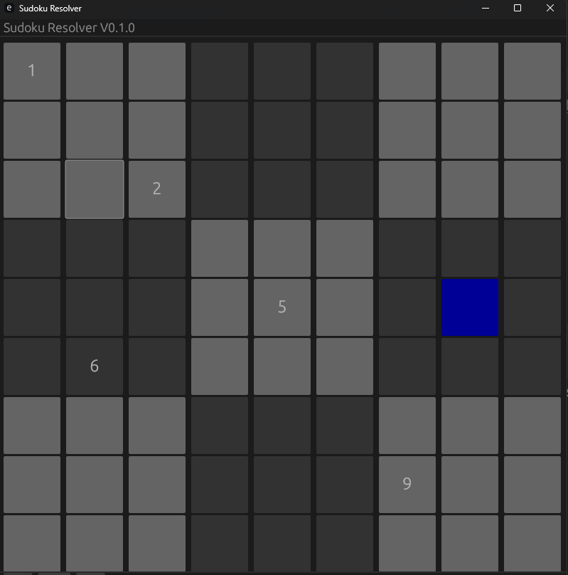
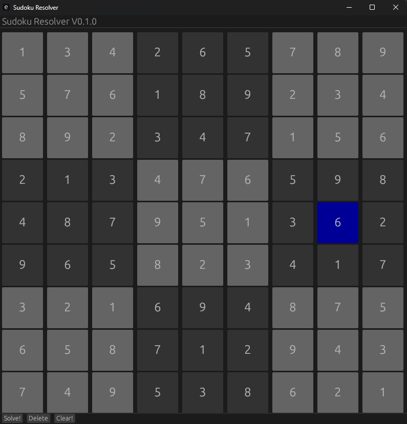

# Sudoku Resolver

Sudoku Resolver is a simple GUI tool that allows users to input a Sudoku puzzle and solve it automatically.





## Features

- Input a Sudoku puzzle using an intuitive graphical user interface.
- Solve the puzzle automatically using a backtracking algorithm.
- Clear the puzzle and start over at any time.

## Installation

To install Sudoku Resolver, you will need to have Rust and Cargo installed on your system. You can download them from the official Rust website.

Once you have Rust and Cargo installed, you can install Sudoku Resolver by cloning this repository and running the following command in the project’s root directory:

```bash
cargo install --path .
```

This will build the project and install the `sudoku-resolver` binary on your system.

## Usage

To use Sudoku Resolver, simply run the `sudoku-resolver` command in your terminal. This will open the graphical user interface, where you can input a Sudoku puzzle and solve it.

## Contributing

Contributions to Sudoku Resolver are welcome! If you would like to contribute, please feel free to open an issue or submit a pull request.

## License

Sudoku Resolver is licensed under the MIT License.